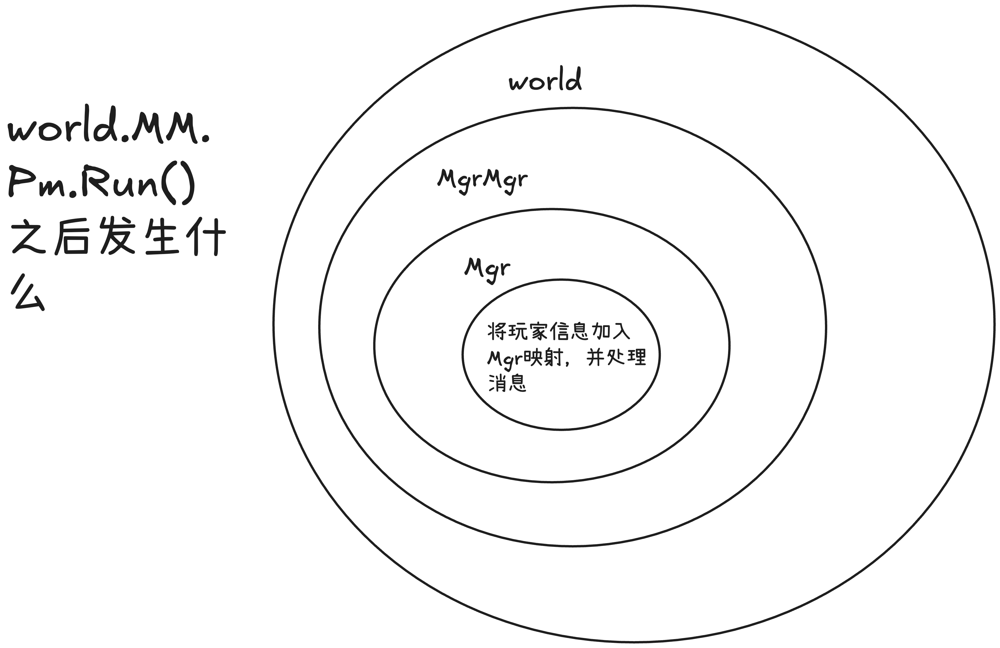

# golang-gameserver
golang游戏服务器开发学习

参考 
https://www.bilibili.com/video/BV1wZ4y1Y7t1?spm_id_from=333.788.videopod.sections&vd_source=4f5bd74c13960dd2866a1b66d1935000

感谢up的无私奉献

## 2025.2.8 18:28
1. 构建了world，player，manager三大模块的框架
2. 梳理了三大模块的嵌套关系，完成了world模块的初始化

