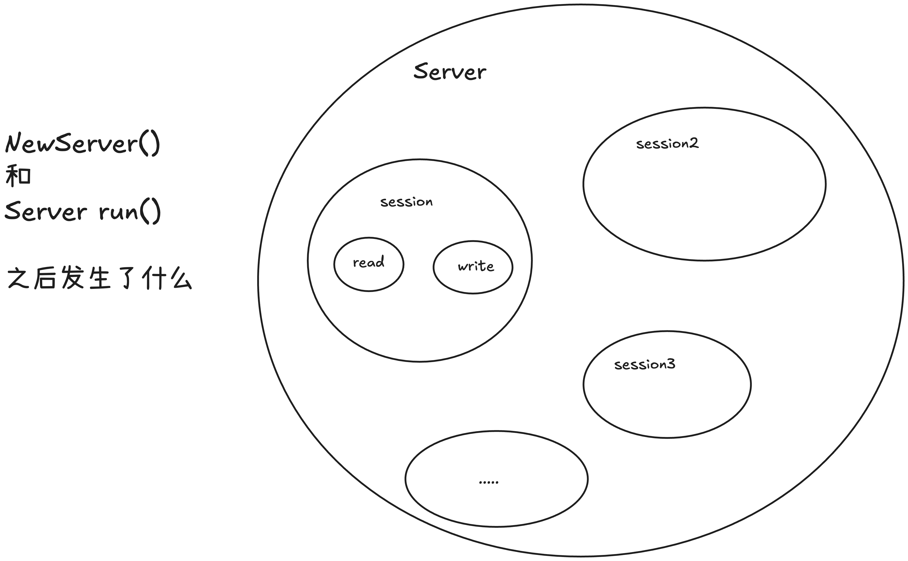
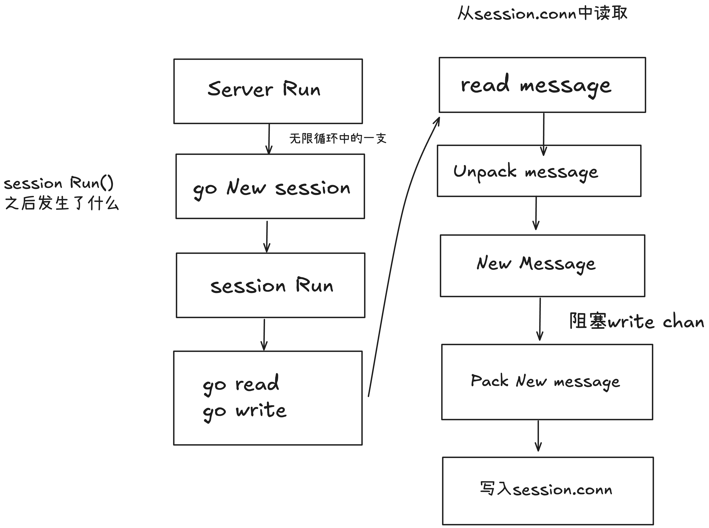

# golang-gameserver
golang游戏服务器开发学习

参考 
https://www.bilibili.com/video/BV1wZ4y1Y7t1?spm_id_from=333.788.videopod.sections&vd_source=4f5bd74c13960dd2866a1b66d1935000

感谢up的无私奉献

## 2025.2.8 18:28
1. 构建了world，player，manager三大模块的框架
2. 梳理了三大模块的嵌套关系，完成了world模块的初始化

## 2025.2.8 21:24

1. 完成了server的基本流程，重点完成了server和session的逻辑，包括初始化，运行，产生会话，从会话读取数据，消息和字节流的转化，写入数据等等
2. 梳理了server和session的功能逻辑，可视化如下

